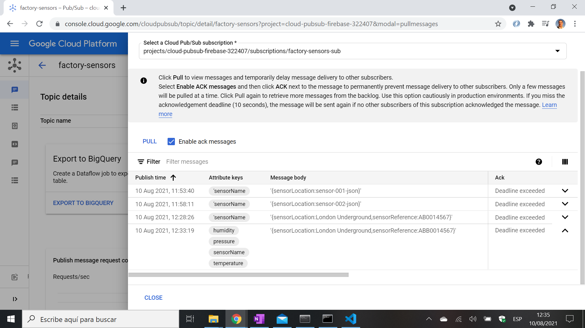

# Cloud Pubsub Firebase

* Publish data to Pub/Sub and write a cloud function to write to Cloud Firestore database
* Code is written in Typescript
* Tutorial code from [D-I-Ry](https://www.youtube.com/channel/UCMHvK9tare9Y9O152C9wm3Q) with some modifications - see [:clap: Inspiration](#clap-inspiration) below
* **Note:** to open web links in a new window use: _ctrl+click on link_


## :page_facing_up: Table of contents

* [Cloud Pubsub Firebase](#cloud-pubsub-firebase)
  * [:page_facing_up: Table of contents](#page_facing_up-table-of-contents)
  * [:books: General info](#books-general-info)
  * [:camera: Screenshots](#camera-screenshots)
  * [:signal_strength: Technologies](#signal_strength-technologies)
  * [:floppy_disk: Setup](#floppy_disk-setup)
  * [:computer: Code Examples](#computer-code-examples)
  * [:cool: Features](#cool-features)
  * [:clipboard: Status & To-Do List](#clipboard-status--to-do-list)
  * [:clap: Inspiration](#clap-inspiration)
  * [:file_folder: License](#file_folder-license)
  * [:envelope: Contact](#envelope-contact)

## :books: General info

* tba

## :camera: Screenshots



## :signal_strength: Technologies

* [Firebase Cloud Functions](https://firebase.google.com/docs/functions) serverless framework to automatically run backend code
* [Firebase Pubsub](https://firebase.google.com/docs/functions/pubsub-events) globally distributed message bus using [message topic 'factory-sensors'](https://cloud.google.com/sdk/gcloud/reference/alpha/pubsub/topics/publish)

## :floppy_disk: Setup

* Ref. tutorial: create new project in Google Cloud Firebase console.
* Select project from VS code terminal e.g. `gcloud config set project cloud-pubsub-firebase-322407`
* Deploy project: `firebase deploy --functions` - 2x `lib` JS files created. Check deployment in console Functions dashboard
* Submit data e.g. `gcloud pubsub topics publish factory-sensors --message '{"sensorLocation":"London Underground", "sensorReference": "0014567"}' --attribute sensorName=sensor-003,temperature=99,humidity=95,pressure=40` Note JSON format of sensorLocation
* View message in Google Cloud Platform Pub/Sub - 'View Messages' and click on 'PULL'
* data stored in FireStore datebase in a collection that is created if it does not exist

## :computer: Code Examples - by [D-I-Ry](https://www.youtube.com/channel/UCMHvK9tare9Y9O152C9wm3Q) with some modifications

* function to transfer data using pubsub

```typescript
exports.insertFromPubsub = functions.pubsub
	.topic('factory-sensors')
	.onPublish((message, context) => {
		console.log('The function was triggered at ', context.timestamp);

		let sensorLocation = '';
    let sensorReference = '';
		try {
			sensorLocation = message.json.sensorLocation;
      sensorReference = message.json.sensorReference;
		} catch (e) {
			functions.logger.error('PubSub message not in JSON format. error:', e);
		}

		let sensorName = '';
		let temperature = '';
		let humidity = '';
    let pressure = '';

		try {
			sensorName = message.attributes.sensorName;
			temperature = message.attributes.temperature;
			humidity = message.attributes.humidity;
      pressure = message.attributes.pressure;
      console.log('sensorName', sensorName);
      console.log('temperature', temperature);
      console.log('humidity', humidity);
      console.log('pressure', pressure);

		} catch (e) {
			functions.logger.error('PubSub message attributes error:', e);
		}

		const sensorInfo = {
			sensorLocation: sensorLocation,
      sensorReference: sensorReference,
			sensorName: sensorName,
			temperature: temperature,
			humidity: humidity,
      pressure: pressure
		};

		return admin.firestore().collection('factorySensors').add(sensorInfo);
	});
```

## :cool: Features

* Firebase setup is always quick to do

## :clipboard: Status & To-Do List

* Status: Working
* To-Do: Nothing

## :clap: Inspiration

* [D-I-Ry: Cloud Functions: moving data from Pubsub to Firebase Cloud Firestore in TypeScript](https://www.youtube.com/watch?v=3Zohd6U6CL8)

## :file_folder: License

* N/A

## :envelope: Contact

* Repo created by [ABateman](https://github.com/AndrewJBateman), email: gomezbateman@yahoo.com